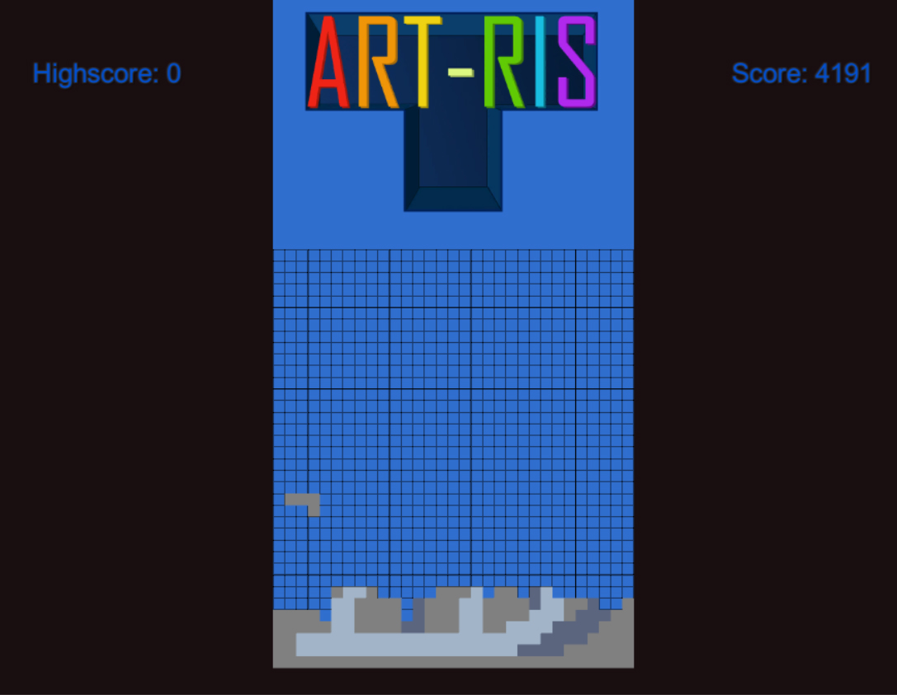
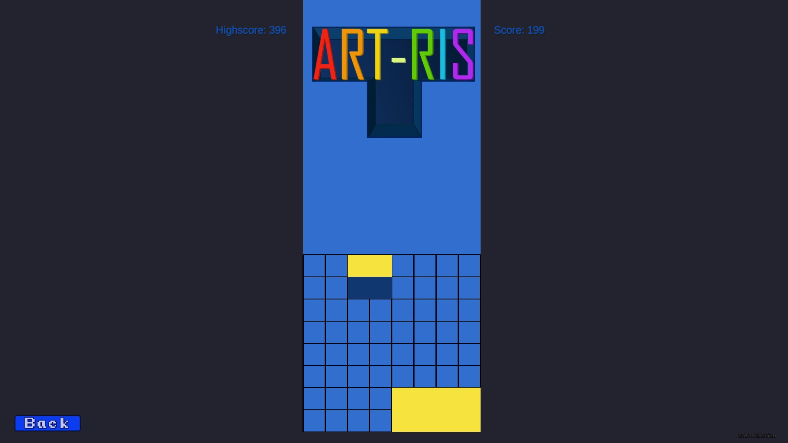
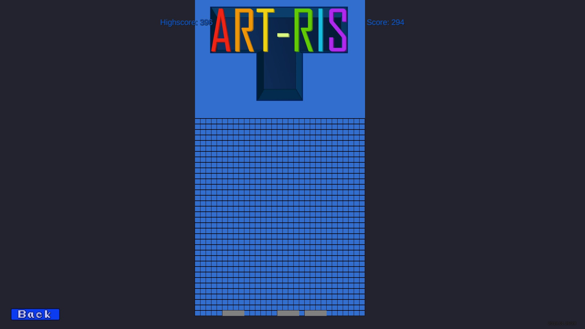
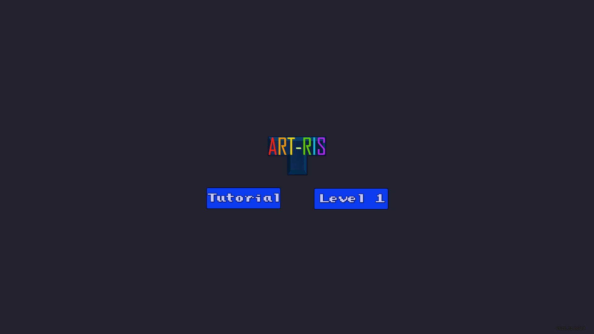

Artris
=======

This is a game created during Global Game Jam 2018 in Kaunas, Lithuania.

#Idea
The main goal of the game is to create a pixel-art image from Tetris pieces while playing Tetris.
The game has instructions page of every level.
They help player put every piece into the right place and imagine a full image to be drawn.

#Screenshots
  

  

  

  

#Links
 - Play Now!: [artris.chocolatebar.lt](artris.chocolatebar.lt)
 - Global Game Jam: [https://globalgamejam.org/2018/games/artris](https://globalgamejam.org/2018/games/artris)
  